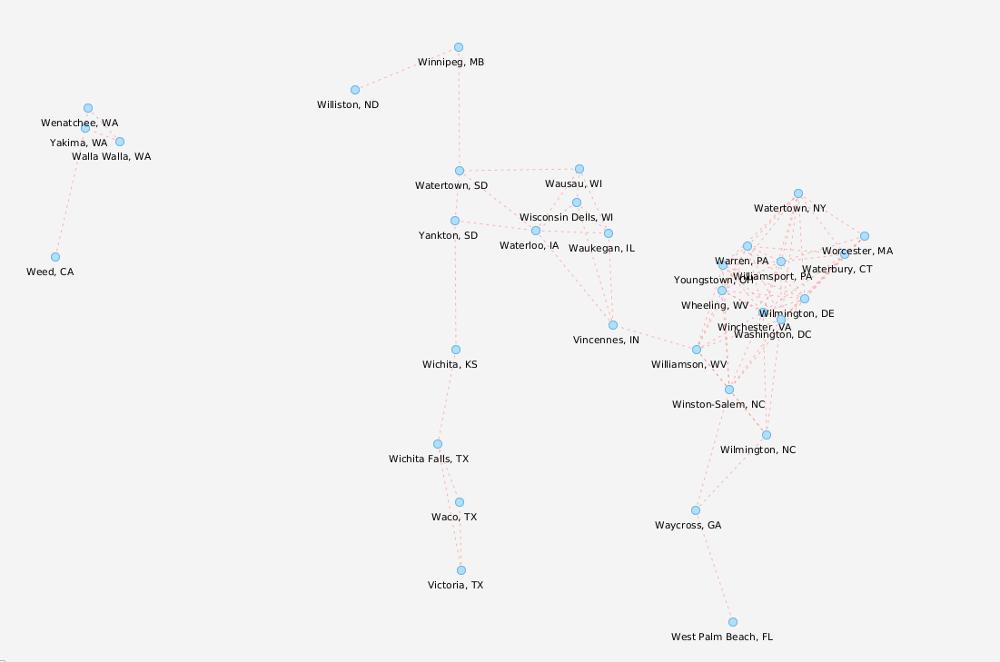
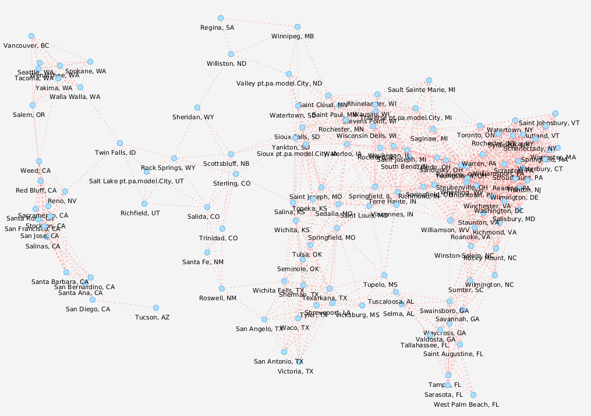

# Projeto PA 2021/22 - Época Normal

# Project developed by:

Eduardo Ferreira nº201100372 

Marco Martins nº201601467

Rui Almeida nº201601035

# Introduction

The main goal of this project consists on developing a java application that is capable of using a graph as a way to store its data 
and assist in having a better understanding/grasp of the locations of each vertex which in this case they will be considered Hubs
containing its name and its weight value, this value will pretty much be the "weight" or "amount" of certain element/product that exists
in the Hub, and its edges that in this particular project will be seen/represent as a distance and necessary travel route between the various existing Hubs.

Basically it must be capable of providing an accurate representation of its logistic network so that we can visualize it, 
obtain the necessary information about each and every vertex/location and edges/routes and manipulate it if needed be whenever certain changes are required.

# How to use

To run the application the user must simply run its main file. Upon running a window will be displayed asking the user to
type the desired dataset that he wishes to read/analyze as well as how to type it.

For example: If the user wishes to read a determined sgb he must type the desired sgb and the specific route, like this "sgb128 routes_2"
even if there's only 1 route in that sgb he still must type the desired route so if we were to choose sgb32 it would have to be "sgb32 routes_1"
we made it this way so theres a common ground when it comes to find a certain sgb and its route so if we in the future were to add another sgb or another route
the user would just need to type it without requiring any changes in the code.
Also a Strategy Pattern has been implemented where the user can choose which type of graph he wishes to create, by default it will always be the 
AdjacencyListGraph but if the user types the desired dataset followed by the letter e then the graph will be chosen as an EdgeList (example: sgb32 routes_1 e)

Upon getting the desired route a pop up will show containing the graph, this part of the code is the one that uses the [JavaFXSmartGraph](https://github.com/brunomnsilva/JavaFXSmartGraph)
and this will now be considered our main screen.
This main screen will now have all the available options the user can do.

These options are:

`1 - Creating Edges:` To create an edge the user must choose from the first two ComboBoxes the desired vertexes they wish to link as well as typing the distance that is between them,
if theres no connection between those 2 vertexes then a new connection will be made, to make such connection the user must press the create button.

`2 - Creating Edges:` To remove an edge the user must choose from the first two ComboBoxes the desired vertexes they wish to remove the connection then click on the remove Button.

`3 - Undo:` To Undo an action the user must simply click the undo button. (We are currently experiencing a visual/graphical bug where for some reason the memento changes arent being shown in the FXSmartGraph
however the memento pattern is fully implemented and working for it is possible to see the changes of the actual graph when we do other options such as seeing the adjacency list where it shows the new edges being either removed or created when we backtrack
as well bfs and dijkstra algorithm recognizing our Undos), for example if we create and edge then type undo that edge will not be seen on the adjacency list nor will be recognized on the algorithms.

`4 - Save:` This option will save the changes we do to our graph, overwritting the routes.txt file with the new or removed edges so next time we load that dataset, the changes will already be visible/applied, in order to do this option
the user must click the save button.

`5 - Dijkstra:` This option will apply the Dijkstra algorithm to our graph, where basically the user must choose the first city (using the comboBoxes above) which will be considered our origin, then the user
must choose the second city on the second comboBox to be considered our destination, after that all the user has to do is click on the Dijkstra button, if the pathway is possible then he will show the shortest/less cost path, if it isnt possible
then there will be an alert/popup message displayed warning the user that it is impossible to create a path for those 2 cities.

`6 - BFS:` This option will apply the BFS algorithm to our graph, to do this the user must select a city from the comboBox(the 3rd comboBox) below (the one closest to the BFS button) and select the number of iterations
the user wishes to do then simply click the BFS Button. This will then do the algorithm and return the neighboring cities depending on how many iterations it was made.

`7 - Adjacency List:` This button simple displayed the list of adjancencies of our graph depending on the type chosen when loading the dataset (EdgeList or AdjacencyList), this output will be shown
differently since both have a different vertex and edge structure.

`8 - Bar chart:` This button simply has all the metrics that were asked to calculate on out graph, it will be displayed all the vertexes rearranged by the number of edges (de-crescent order) as well as showing the number of edges each one has
it will also display the total number of vertexes we have on our graph as well as the total number of edges. It will displayed the number of subgraphs that our graph contains and will also
display a proper chart showing the top 5 cities of our graph(the ones with most edges). To do all of this the user must click the bar chart button.

# Classes used

`Hub:` This class will contain the name and weight of a Hub, basically storing the name of the hub
plus its ammount/weight and their position on the graph, other than that the methods are simply getters and setters.

`Route:` This class will contain the distance, storing the distance and having its getters and setters.

`Positions` This class will contain the coordinates x and y of a hub and well as getters.

`DatasetReader:` This class will focus solely on reading the dataset files.

`ManipulateInputs:` This class will be responsable for knowing which dataset to read after receiving the user input as well as manipulate said input
to create the Logistic Network and issue our Controller.

`Logistic Network:` This class will contain the information obtained from all the text files, basically storing everything so that later may be used
on building the graph, though it might seem rather unnecessary since we could just read and build the graph using simply local variables on the FileReader this way provides an ease of access
for future implementations and if we ever need to have a way to change the values of the current text files
we can easily apply the alterations here and then write them back onto the current textfiles so next time we read them it will display an updated graph.

`Alerts:` This class is rather peculiar, it will pretty much function as a pop-up window to display errors / messages, so it works kinda like an exception but instead this alert 
is thrown showing the error that is happening to the user so he may he correct himself.
 
`GraphicalUI:` A simple UI class that will mainly serve to show the first screen where we obtain our dataset before it closes off.

`GraphView:` The main view of out project it will save to display everything that we need to know about the project as well as all the options the user has.

`GraphAdjacencyList:` This is our graph class, it uses the data structure of an adjacency list, the template was obtained from the Advanced Programing Class pdf file
that discusses the 3 types of structures that can be used (matrix / edgelist / adjacencyList). It contains all the methods to be able to manipulate the information and create our graph.

`GraphController:` This class is out controller and pretty much serves to link the view with the model to obtain an send data around.

`GraphModel` This class contains all the functionalities of out project, its pretty much where the logic data is and where everything is processed.

`Observable` The Observable interface that is needed to implement the Observer pattern.

`Observer` The Observer interface that is needed to implement the Observer pattern.

`Subject` The abstract class that is extended by our Model as a way to properly notify our observers (View) and apply the Observr Pattern.

`Memento` The Memento interface that will be implementend by our private class inside the model in order to use the Memento pattern.

`Originator` The Originator interface that will be used to apply our Memento pattern.

`Caretaker` The Caretaker class that will be used to manipulate our memento in order to apply runtime saves to the changes being done.

`Dijkstra` The Dijkstra class that contains the Dijkstra algorithm so that we can apply it.

`DijkstraResult` The DijkstraResult class will contain the correct/minimal cost Path as well as the actualy cost that it takes to go from point A to B
this class is returned by the Dijkstra Class.

`BreathFirstSearch` This class applys the BFS algorithm to out graph and return the result after x iterations (an input the user chooses).

# Important/complex Methods Explanation

## GraphModel

`centrality()` This method is responsible for rearranging the graph so that we can order it by how many edges each vertex has (de-crescent order)

`numberOfSubGraphs()` This method is responsable  in returning the number of subgraphs a graph has.

`dijkstra(Vertex<Hub> hub1, Vertex<Hub> hub2)` This method is responsable for sending our graph onto our Dijkstra class in order to apply the algorith,
since the algorithm we used was the one taught in our University classes, that algorithm contained a bug where if the graph had more than one subgraph
then it would blow up, to fix this we decided to simply send the subgraph where both vertexes belong since every other vertex outside that subgraph
has a value of infinite and therefore meaningless.(it uses some auxiliary subclasses in order to avoid bloating)

## Alerts

`Display` This method will be used to create a pop-up window to warn the user that something he types is incorrect and the files couldn't be found,
it extends from FiLeNotFoundException and a super with the message so it also displays on console.

## GraphAdjacencyList

Every method from this class already exists on another class called GraphEdgeList which was a class already built in that would produce
the graph with a different data structure, so basically GraphAdjacencyList does what GraphEdgeList does but the methods were
changed/developed to work with an entirely new data structure where each vertex holds a list of incident edges.

## GraphView

`createSidePanel()` This is responsable for creating all the buttons/texfields and comboBoxes that will be displayed to the user.

# File and folder structure

- `/dataset` - Contains the *datasets* that we can import with the application
- `/src` - Contains the source code of the application
    - `com.brunomnsilva.smartgraph` - *Package* contains the library [JavaFXSmartGraph](https://github.com/brunomnsilva/JavaFXSmartGraph).
    - `pt.pa` - *Package* where the project will be developed on.
        - `*.graph` - *Package* contains an ADT Graph and a functional implementation based on the edgeList structure.
        - `*.model` - *Package* contains the model classes for the application.
        - `*.view` - *Package* contains the graphical part of the application.
    - `Main.java` - The main file for the application, where the app will be run.
- `/test` - Contains the unit tests of our application
- `smartgraph.css` - *Stylesheet* used by the library JavaFXSmartGraph
- `smartgraph.properties` - *Properties* used by the library JavaFXSmartGraph
- `README.md` - Our readme file.
-  `READMEPT` - Our readme file translated into Portuguese.
# Data to import

The files are in text format, and they can contain commentary in certain lines, those lines are to be disregarded. Commentaries have a `"#"` symbol before it.

The *datasets* are in the local `dataset` folder, so any file located in that folder can be opened with, e.g., `new FileReader("dataset/<folder>/<file>.txt")`, `<file>` being the respective file to open.
Theres two specific *datasets*, `sbg32` e `sbg128`, containing 32 e 128 hubs respectively.

Each dataset contains the following files:

- `name.txt` - Names of the cities where the *hubs* are located
- `weight.txt` - Population of the cities where the *hubs* are located
- `xy.txt` - coordinates of the cities where the *hubs* are located

- `routes_*.txt` - Distance matrix([wikipedia](https://pt.wikipedia.org/wiki/Matriz_de_dist%C3%A2ncias)) responsible for charting all the hubs - there can be different routes, they are mainly identified with the suffix `"_1"` e `"_2"`.

# Desired result of the pre-existing SGBs

### sgb32

`routes_1.txt` (Split graph - 2 components):

### sgb128

`routes_1.txt` (1 component):

`routes_2.txt` (Split graph - 3 componenes):

