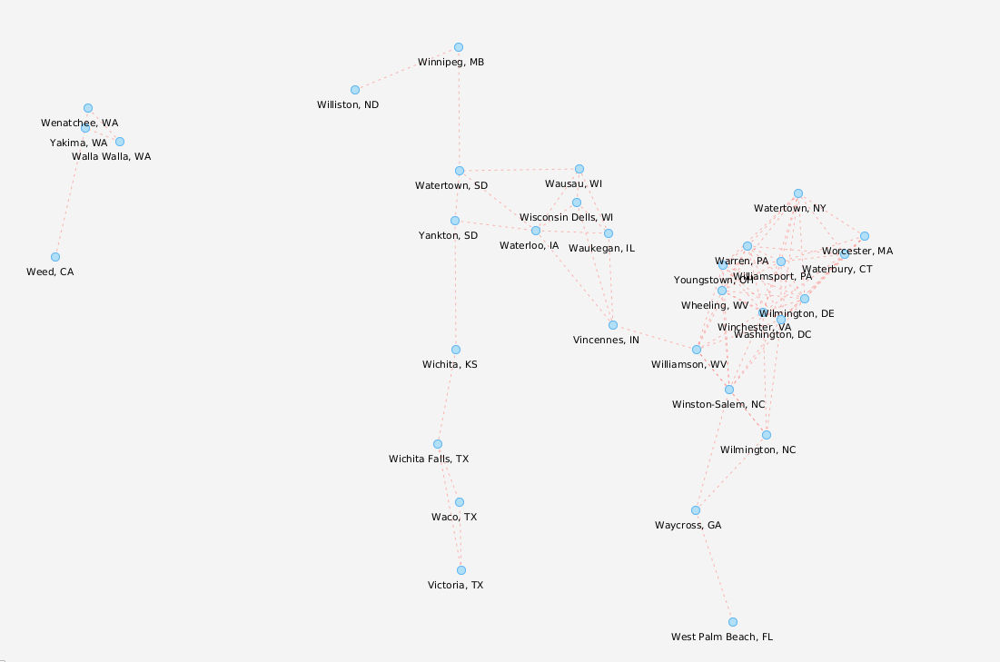
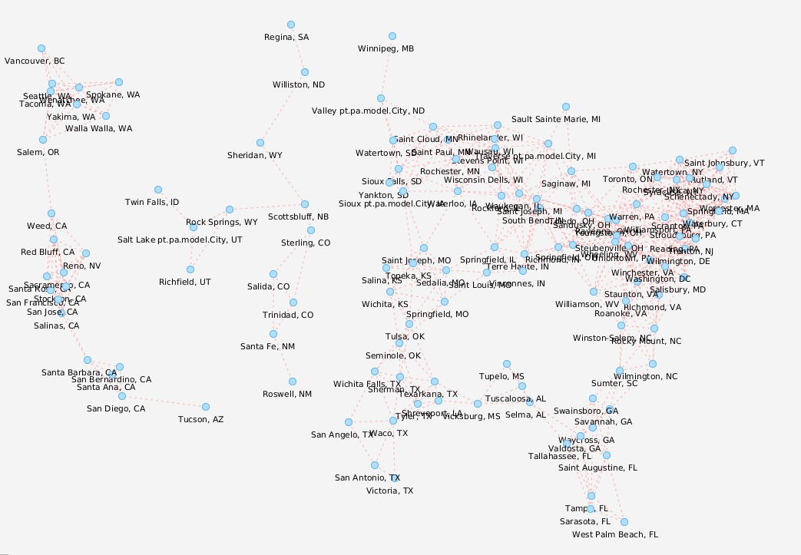

# Projeto PA 2021/22 - Época Normal

# Projecto desenvolvido por:

Eduardo Ferreira nº201100372

Marco Martins nº201601467

Rui Almeida nº201601035

# Introdução

O principal objectivo deste projecto consiste em desenvolver uma aplicação java capaz de utilizar um gráfico como forma de armazenar os seus dados e ajudar a ter uma melhor compreensão/grasp das localizações de cada vértice que, neste caso, serão considerados Hubs
contendo o seu nome e o seu valor de peso, este valor será praticamente o "peso" ou "quantidade" de determinado elemento/produto que existe
no Hub, e as suas margens que neste projecto em particular serão vistas/representadas como uma distância e rota de viagem necessária entre os vários Hubs existentes.

Basicamente, deve ser capaz de fornecer uma representação precisa da sua rede logística, para que possamos visualizá-la,
obter a informação necessária sobre cada vértice/localização e arestas/rotas e manipulá-la, se necessário, sempre que certas alterações forem necessárias.

# Como utilizar

Para executar a aplicação, o utilizador deve simplesmente executar o seu ficheiro main. Ao correr uma janela será exibida pedindo ao utilizador para
digite o conjunto de dados desejado que deseja ler/analisar, bem como a forma de o digitar.

Por exemplo: Se o utilizador desejar ler um sgb determinado, deve escrever o sgb desejado e a rota específica, como esta "sgb128 rotas_2".
mesmo que haja apenas 1 rota nesse sgb ele ainda tem de digitar a rota desejada, por isso se escolhêssemos sgb32 teria de ser "sgb32 routes_1".
tornámo-lo assim um terreno comum quando se trata de encontrar uma certa sgb e a sua rota, por isso, se no futuro acrescentarmos outra sgb ou outra rota
o utilizador apenas precisaria de o digitar sem exigir quaisquer alterações no código.

Ao obter a rota desejada aparecerá um pop up contendo o gráfico, esta parte do código é a que utiliza o [JavaFXSmartGraph](https://github.com/brunomnsilva/JavaFXSmartGraph).
No entanto, isto não é o fim da aplicação, no ecrã principal estará agora um título no topo mostrando qual sgb estamos a ver e
do lado esquerdo haverá numerosas opções que o utilizador pode escolher (para o 1º milestone existem apenas 2 opções),
o utilizador tem simplesmente de digitar o número que identifica uma destas opções, a fim de as activar.

Estas opções são:

`1 - Novo Conjunto de Dados:` Utilizando este, o utilizador pode "recuar" e a partir do conjunto de dados actual para ver outro.

`2 - Adjacency List:` Utilizando esta opção uma lista javafx observável aparecerá no centro e no lado direito do ecrã principal exibindo todos os vértices e as arestas incidentes ligados a cada um deles.

Optamos por ter a aplicação a funcionar desta forma em vez de apenas aplicar e Hbox no [JavaFXSmartGraph](https://github.com/brunomnsilva/JavaFXSmartGraph) e exibi-la
no ecrã principal porque desta forma, no futuro, podemos exibir qualquer tipo de informação necessária no nosso ecrã principal, transformando-o efectivamente num
colector de informações, mantendo a parte visual separada noutra janela para facilitar a observação do gráfico sem quaisquer outras distracções à sua volta.

# Classes utilizadas

`Hub:` Esta classe conterá o nome e o peso de um Hub, armazenando basicamente o nome do hub
mais a sua quantidade/peso, para além do facto de os métodos serem simplesmente getters e setters.

`Route:` Esta classe conterá a distância, armazenando a distância e tendo os seus getters e setters.

`FileReader:` Esta classe concentrar-se-á unicamente na leitura das entradas do utilizador e aplicá-las, é onde o gráfico será armazenado como variável/objeto, bem como outras variáveis que consideramos
necessário como a Rede Logística (será explicado mais detalhadamente sobre a classe abaixo porque criámos isto)

`Logistic Network:` Esta classe conterá a informação obtida de todos os ficheiros de texto, armazenando basicamente tudo para que mais tarde possa ser utilizado
na construção do gráfico, embora possa parecer bastante desnecessário, uma vez que poderíamos apenas ler e construir o gráfico usando simplesmente variáveis locais no FileReader desta forma proporciona uma facilidade de acesso
para futuras implementações e se alguma vez precisarmos de uma forma de alterar os valores dos ficheiros de texto atuais
podemos facilmente aplicar as alterações aqui e depois escrevê-las de novo nos ficheiros de texto atuais, para que da próxima vez que as lermos apresente um gráfico atualizados.

`Alerts:` Esta classe é bastante peculiar, funcionará praticamente como uma janela pop-up para exibir erros / mensagens, por isso funciona como uma espécie de exceção, mas em vez disso este alerta
é atirado mostrando o erro que está a acontecer ao utilizador para que este possa corrigir-se a si próprio.

`GraphicalUI:` Como o nome sugere, esta classe conterá os métodos que manipularão o que será exibido no utilizador.

`GraphAdjacencyList:` Esta é a nossa classe gráfica, utiliza a estrutura de dados de uma lista adjacente, o modelo foi obtido a partir do ficheiro pdf da Classe de Programação Avançada.
que discute os 3 tipos de estruturas que podem ser utilizadas (matriz / edgelist / adjacencyList). Contém todos os métodos para ser capaz de manipular a informação e criar o nosso gráfico.

# Explicação de Métodos Importantes

## FileReader

`readInput:` Este método será puramente dedicado à leitura das entradas do utilizador, no início detectará se já está a ser exibido um gráfico,
Se assim for, então saltará essa parte e entrará na condição de um switch , este swich utiliza um inteiro para escolher para onde tem que se dirigir,
esse inteiro está ligada à entrada do utilizador quando se trata de escolher uma das muitas opções que serão implementadas para manipular/afetar o gráfico, por agora
só pode ler outro conjunto de dados (reiniciar a aplicação de uma forma), ou optar por mostrar uma lista de adjacências

`createNetwork:` Este método será responsável por instanciar o objecto logisticNetwork e colocar sobre ele o que é lido a partir dos ficheiros de texto, para que possa ser
numa altura posterior utilizada para criar o nosso gráfico.

`createVertexes:` Este método criará os vértices do gráfico das horas.

`createEdges` Após as arestas terem sido criadas, este método implementará todas as suas arestas, passando a informação para a nossa GraphAdjacencyList
para actualizar os nossos vértices já existentes.

## Alerts

`Display` Este método será utilizado para criar uma janela pop-up para avisar o utilizador de que algo que digita está incorrecto e que os ficheiros não puderam ser encontrados, extensão da  exceção FiLeNotFoundException e um super com a mensagem, pelo que também é apresentado na consola.

## GraphicalUI

`addTopContents` Isto será responsável por acrescentar o título do nosso conjunto de dados para sabermos qual sgb escolhemos, é uma Hbox que será manipulada para estar no topo do ecrã.

`addBottomContents` Isto será responsável por adicionar a caixa de entrada no nosso ecrã, para que possamos receber a entrada do utilizador, também cria um botão enter para enviar a informação, embora premindo enter no teclado funcione também.

`addLeftContents` Isto será responsável por mostrar as numerosas opções que existirão na nossa aplicação. Mostrará praticamente uma lista de todas as opções disponíveis que o utilizador pode fazer depois de ter carregado o gráfico.

`designGraph` Este método será responsável pela conceção do gráfico depois de toda a informação ter sido obtida.

`setGraphPositions` Este método é chamado de `designGraph` e irá colocar todos os vértices nas posições correctas.

`displayAdjacency` Este método é uma das opções que o utilizador terá após o gráfico ter sido carregado, e praticamente
serve para mostrar a lista de adjacências ao nosso utilizador numa abordagem de front end.

## GraphAdjacencyList

Cada método desta classe já existe noutra classe chamada GraphEdgeList, que era uma classe já construída que produziria
o gráfico com uma estrutura de dados diferente, portanto basicamente o GraphAdjacencyList faz o que o GraphEdgeList faz mas os métodos foram
alterado/desenvolvido para trabalhar com uma estrutura de dados inteiramente nova, onde cada vértice contém uma lista de arestas incidentes.

# Estrutura de ficheiros e pastas

- `/dataset` - Contém os conjuntos de dados que podemos importar com a aplicação
- `/src` - Contém o código fonte da aplicação
    - `com.brunomnsilva.smartgraph` - *Package* contém a biblioteca [JavaFXSmartGraph](https://github.com/brunomnsilva/JavaFXSmartGraph).
    - `pt.pa` - *Package* em que o projeto será desenvolvido.
        - `*.graph` - *Package* contém um Gráfico ADT e uma implementação funcional baseada na estrutura da edgeList.
        - `*.model` - *Package* contém as classes modelo para a aplicação.
        - `*.view` - *Package* contém a parte gráfica da aplicação.
    - `Main.java` - o ficheiro Main, onde a aplicação será executada.
- `/test` - Contém os testes unitários da nossa aplicação
- `smartgraph.css` - *stylesheet* utilizada pela biblioteca JavaFXSmartGraph
- `smartgraph.properties` - *Properties* utilizado pela biblioteca JavaFXSmartGraphh
- `README.md` - O nosso ficheiro readme.

# Dados a importar

Os ficheiros estão em formato de texto, e podem conter comentários em certas linhas, essas linhas devem ser desconsideradas. Os comentários têm um símbolo `"#"` antes dele.

O conjunto de dados encontram-se na pasta local `dataset`, pelo que qualquer ficheiro localizado nessa pasta pode ser aberto com, por exemplo, `new FileReader("dataset/<folder>/<file>.txt")`, `<file>` sendo o respetivo ficheiro a abrir.
Há dois conjuntos de dados específicos, `sbg32` e `sbg128`, contendo 32 e 128 hubs, respetivamente.

Cada conjunto de dados contém os seguintes ficheiros:

- `name.txt` - Nomes das cidades onde os *hubs* estão localizados
- `weight.txt` - População das cidades onde os *hubs* estão localizados
- `xy.txt` - Coordenadas das cidades onde os *hubs* estão localizados

- `routes_*.txt` - Matriz de distância([wikipedia](https://pt.wikipedia.org/wiki/Matriz_de_dist%C3%A2ncias)) responsáveis pelo mapeamento de todos os centros - podem existir diferentes rotas, são principalmente identificadas com o sufixo `"_1"` e `"_2"`

# Resultado desejado dos SGBs pré-existentes

### sgb32

`routes_1.txt` (Gráfico de divisão - 2 componentes):

### sgb128

`routes_1.txt` (1 componente):

`routes_2.txt` (Gráfico dividido - 3 componentes):

